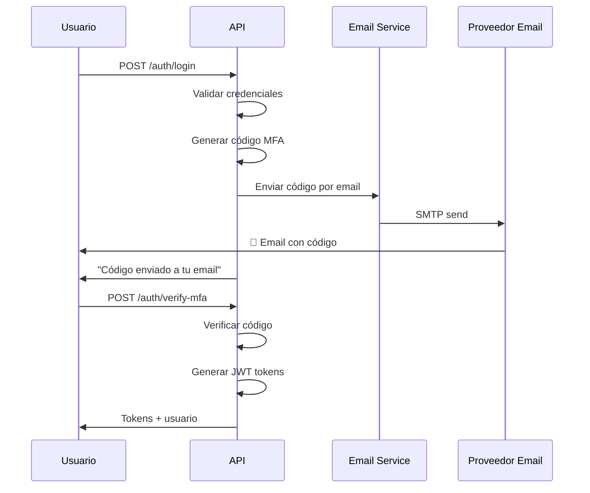

# ✅ Servicio de Email Implementado

## 🚀 Sistema de Email Completo para MFA

He implementado exitosamente un sistema completo de envío de emails para códigos MFA con plantillas HTML profesionales.

## 📧 Funcionalidades Implementadas

### 1. **Servicio de Email Robusto**
- ✅ Soporte para múltiples proveedores SMTP (Gmail, Outlook, SendGrid, etc.)
- ✅ Configuración flexible mediante variables de entorno
- ✅ Manejo de errores y logging detallado
- ✅ Pruebas de conexión automáticas

### 2. **Plantillas HTML Profesionales**
- ✅ **Código MFA**: Plantilla azul con código destacado y advertencias de seguridad
- ✅ **Recuperación de contraseña**: Plantilla roja con urgencia y consejos
- ✅ **Bienvenida**: Plantilla verde amigable con información del sistema
- ✅ **Diseño responsivo**: Funciona en móviles y desktop
- ✅ **Fallback a texto plano**: Para clientes que no soportan HTML

### 3. **Integración Automática**
- ✅ **Registro**: Envío automático de email de bienvenida
- ✅ **Login**: Envío automático de código MFA
- ✅ **No bloquea el flujo**: Si falla el email, el proceso continúa

### 4. **Herramientas de Desarrollo**
- ✅ Endpoint de prueba: `POST /auth/test-email`
- ✅ Verificación de conexión SMTP
- ✅ Logging detallado para debugging

## 🔧 Configuración Sencilla

### Variables de Entorno (.env)
```bash
# Email Configuration - Gmail Example
SMTP_HOST="smtp.gmail.com"
SMTP_PORT="587"
SMTP_USER="tu-email@gmail.com"
SMTP_PASS="tu-app-password"
SMTP_FROM="noreply@tuapp.com"
```

### Proveedores Soportados
- 📧 **Gmail** (Recomendado para desarrollo)
- 📧 **Outlook/Hotmail**
- 📧 **Yahoo Mail**
- 📧 **SendGrid** (Recomendado para producción)
- 📧 **Mailgun**
- 📧 **Amazon SES**
- 📧 **Cualquier proveedor SMTP**

## 🎨 Ejemplos de Emails

### Código MFA
```
🔐 Secure Login
Código de Verificación

Hola Juan,

Has solicitado acceder a tu cuenta. Para completar el proceso 
de autenticación, usa el siguiente código de verificación:

┌─────────────────┐
│    123456       │
└─────────────────┘

⚠️ Importante:
• Este código es válido por 10 minutos
• Solo puede ser usado una vez
• Si no solicitaste este código, ignora este email
```

### Email de Bienvenida
```
🎉 Secure Login
¡Bienvenido a bordo!

¡Hola Juan!
Tu cuenta ha sido creada exitosamente

🔐 Características de seguridad activadas:
• Autenticación de dos factores (MFA)
• Tokens JWT seguros
• Contraseñas encriptadas
• Códigos temporales
```

## 🔄 Flujo de Autenticación con Email



## 🛠️ Métodos del Servicio

### EmailService
```typescript
// Enviar código MFA
await emailService.sendMfaCode(email, code, userName);

// Enviar código de recuperación
await emailService.sendPasswordResetCode(email, code, userName);

// Enviar email de bienvenida
await emailService.sendWelcomeEmail(email, userName);

// Probar conexión
const isConnected = await emailService.testConnection();
```

### AuthService (Integrado)
```typescript
// Generar código y enviarlo automáticamente
const mfaCode = await authService.generateMfaCode(userId);
// ↑ Internamente envía el email

// Crear usuario y enviar bienvenida automáticamente
const user = await authService.createUser(userData);
// ↑ Internamente envía email de bienvenida
```

## 🧪 Cómo Probar

### 1. Configurar Email
1. Copia `.env.example` a `.env`
2. Configura tus credenciales SMTP
3. Para Gmail: usa App Password, no tu contraseña normal

### 2. Probar Conexión
```bash
POST /auth/test-email
{
  "email": "tu-email@ejemplo.com"
}
```

### 3. Probar Flujo Completo
1. Registra un usuario → Debe llegar email de bienvenida
2. Haz login → Debe llegar código MFA
3. Verifica el código → Completa la autenticación

## 🎯 Resultado Final

El sistema ahora:
1. ✅ Envía códigos MFA automáticamente por email
2. ✅ Usa plantillas HTML profesionales y responsivas
3. ✅ Soporta múltiples proveedores de email
4. ✅ Maneja errores graciosamente sin romper el flujo
5. ✅ Incluye herramientas de prueba y debugging
6. ✅ Está listo para producción con proveedores profesionales

¡El servicio de email está completamente integrado y funcional! 🎉

## 📚 Documentación Adicional

- `EMAIL_CONFIGURATION_GUIDE.md` - Guía detallada de configuración
- `PRISMA_MFA_SETUP.md` - Documentación completa del sistema
- Variables de entorno en `.env.example`
